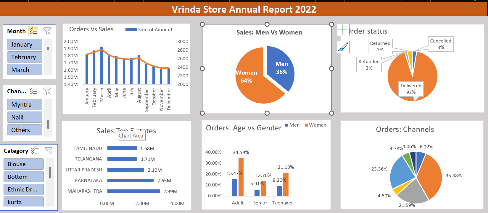
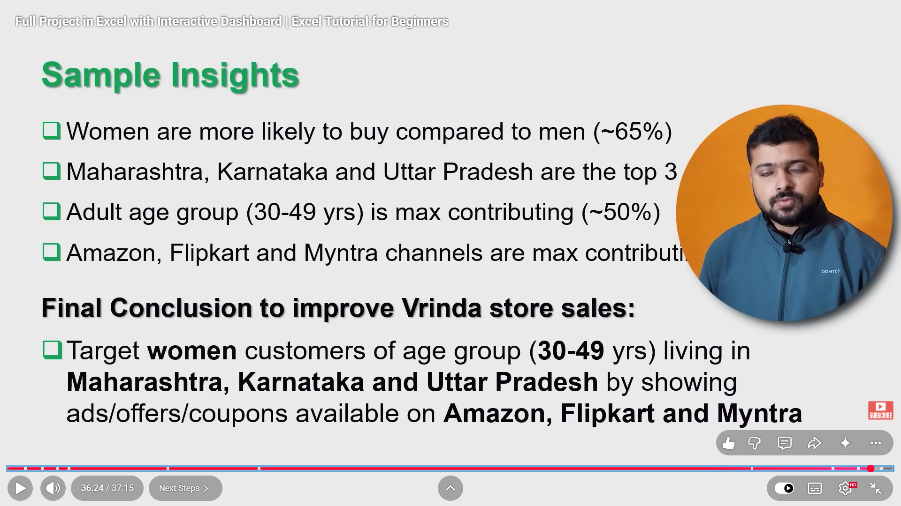

Vrinda Store Annual Report 2022 - Excel Dashboard

📊 Project Overview
Analyzed 2022 annual sales data of Vrinda Store. Built an interactive dashboard in Excel to track Orders, Sales, and Customer Demographics.

🖼️ Dashboard

❓ Business Questions Answered

| Question | Answer From Dashboard |
| :--- | :--- |
| Compare sales & orders in single chart? | Created Combo Chart - Bar for Sales & Line for Orders |
| Highest sales month? | **March 2022** - 1.92M Sales & Highest Orders |
| Who purchased more? | **Women (64%)** vs Men (36%) |
| Different order status? | Delivered 92%, Cancelled 3%, Returned 3%, Refunded 2% |
| Top 5 States? | Maharashtra (2.99M), Karnataka (2.65M), UP (2.10M), Telangana (1.71M), Tamil Nadu (1.68M) |
| Age & Gender relation? | Adult Women (30-49 yrs) is top contributor - 34.59% |
| Best Channel? | **Amazon - 35.48%**, Myntra - 23.36%, Flipkart - 21.59% |
| Final Strategy? | Target Women (30-49) from MH, KA, UP via Amazon/Myntra/Flipkart |

💡 Key Insights

- Women are more likely to buy (~65%)
- Top States: Maharashtra, Karnataka, Uttar Pradesh
- Adult Age Group (30-49) is max contributing (~50%)
- Amazon, Flipkart, Myntra are top channels

🎯 Final Recommendation
> To improve Vrinda Store sales, target **Women (30-49 yrs)** living in **Maharashtra, Karnataka & UP** through **Amazon, Myntra & Flipkart** with tailored ads/coupons/offers.

🛠️ Tools & Skills Used
- Advanced Excel: Pivot Table, Slicers, VLOOKUP, SUMIF, Combo Charts, Pie Charts
- MIS Reporting & Data Visualization
- Business Decision Making

📚 Reference Questions

📁 Files Included
- `Vrinda_Store_2022.xlsx` - Complete Excel Dashboard File
- `Dashboard.png` - Dashboard Screenshot
- `Insights.png` & `Questions.png` - Analysis Reference

👤 Author
Rishabh Kumar
Aspiring MIS Executive 
Skills: Excel, MIS Reporting, Dashboard

https://www.linkedin.com/in/rishabh-kumar-530818254/
